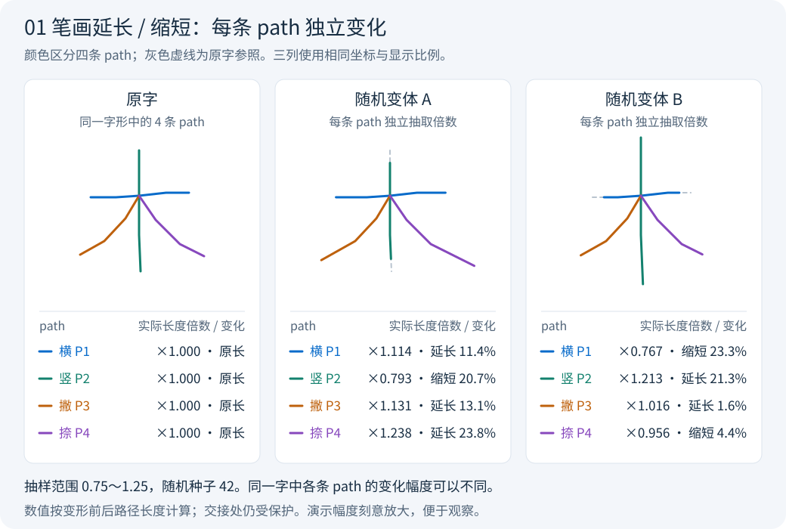
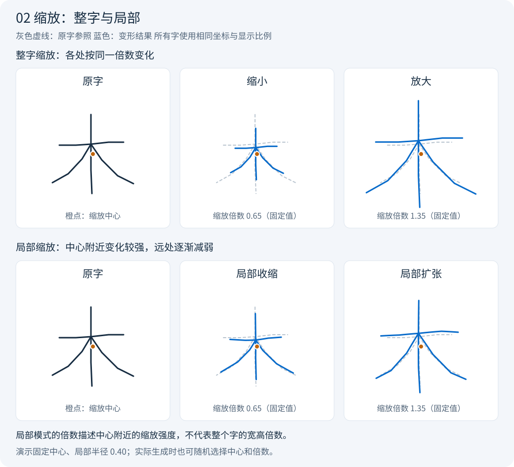

# Glymorph

Glymorph 是一个可复用的轨迹字体变体生成工具，名字由 **Glyph**（字形）和 **Morph**（变形）组合而来。

## 项目背景

使用写字软件驱动写字机时，如果只使用一套字体，同一个字每次出现都会采用相同的字形。
真实手写中的笔画长短、局部比例通常会有细微变化，而完全重复的字形容易让人辨识出机器书写的痕迹。

写字软件的“混合字体”选项可以从多套字体中随机选字，但直接混用不同来源的字体，
又容易出现风格不一致的问题：相邻字的笔势、结构和书写习惯可能差异明显，使整段文字显得不自然。

为了保留自己的书写风格，用户也会录入自己的手写字制作字体。不过，如果每个字只录入一种写法，
即使字体来自本人手写，同一个字反复出现时仍会完全一致。逐字录入多种写法则需要额外的时间和精力。

写字软件自带的变形选项通常集中在平移、旋转、横向或竖向压缩等简单的整体变换。
这些操作能改变字的位置、方向或宽高，却难以表现手写时某一笔略长、略短，或字内局部比例变化的细节。

Glymorph 的思路是：**以同一套字体为基础，通过可调的几何变形生成多套变体，再交给写字软件随机选用。**
输入既可以是现成字体，也可以是用户自己录入的手写字体。项目希望在尽量保留原有书写风格的同时，
减少重复字形的机械感，让变化发生在笔画长短和局部比例上。目前提供笔画延长/缩短与缩放两项操作，
可以分别启用或叠加，并调节各自的变化幅度。

## 先看效果：两种可叠加的变形

你可以只改变笔画长短、只使用缩放，也可以同时开启两项。
**两项默认都关闭，需要明确选择。**

下面用同一个手工构造的“木”字示意轨迹演示，图片由项目当前算法生成。
为了方便看清差别，演示幅度比后面入门命令的幅度大。
**灰色虚线是原字参照；各图保持相同的坐标和显示比例。**
长短示意图用不同颜色区分各条 path，缩放示意图用蓝色表示变形结果。

### 1. 笔画延长 / 缩短

**每条 path 独立选择自己的长度倍数。** 同一个字里，可以横画延长、竖画缩短，
撇和捺又各自变化不同幅度；每次生成新变体时重新抽样。
延长时沿笔端原来的方向向外延伸，缩短时从笔端沿原来的线条向内收回。
相接、相交的区域会受到保护，因此有些笔端的变化会受限，或保持不变。



上图的两个变体使用相同的 `0.75`～`1.25` 抽样范围，图下方标出**各 path 的实际长度变化**。
例如，变体 A 的横画约为原长的 `1.114` 倍，竖画约为 `0.793` 倍，撇和捺分别约为
`1.131` 倍和 `1.238` 倍。同样的参数范围会生成字内比例不同的变体。
只有把上下限设成相同值时，各条 path 才会获得相同的目标倍数；这是固定值用法。

用 `--length` 开启，再用 `--length-min` 和 `--length-max` 设置长度倍数范围：

| 范围 | 含义 |
|---|---|
| `0.95` ～ `1.05` | 每条轨迹随机选择目标长度，可缩短或延长最多 5% |
| `0.90` ～ `0.98` | 只缩短，目标为原长的 90%～98% |
| `1.02` ～ `1.10` | 只延长，目标为原长的 102%～110% |
| 两端都设为 `1.05` | 所有可调整轨迹都以延长 5% 为目标 |

倍数描述的是**整条轨迹的目标长度**，实际变化可能因交接保护而更小。
这里的“笔画”按字体文件记录的连续落笔轨迹处理，不一定对应语文课上划分的标准笔画。

### 2. 缩放

这一项为整个字形选取一个中心和缩放倍数，各条 path 共用同一缩放规则。
线条向中心收拢或向外展开；局部模式再按离中心的距离减弱影响。
用 `--scale` 开启后，可选两种模式：

| 模式 | 直观效果 | 选项 |
|---|---|---|
| **局部缩放（默认）** | 中心附近的局部比例发生变化，离中心越远影响越弱 | `--scale-mode local` |
| **整字缩放** | 整个字按相同倍数放大或缩小，保持宽高比例 | `--scale-mode global` |



用 `--scale-min` 和 `--scale-max` 设置缩放倍数范围：小于 `1` 表示收缩，
大于 `1` 表示扩张，`1` 表示不变。**局部模式的倍数描述中心附近的缩放强度，
并不表示整个字的宽高都乘以这个数。** 缩放中心本身不移动。

还可以调节两个直观的选项：

- **中心在哪里**：默认 `--scale-center random`，为每个字形在字形框内随机选点；
  改为 `--scale-center center` 则固定使用字形框中心。上图使用固定中心，便于比较。
- **局部影响多大范围**：`--scale-radius 0.35` 表示影响半径为字形最大边长的 35%。
  数值越小，变化越集中；越大，影响范围越广。影响会逐渐衰减，半径不是硬边界。
  上图为了展示差别使用 `0.40`；这个选项只用于局部模式。

同时启用两项时，顺序固定为**先调整长短，再缩放**。

## 开始使用

### 第一步：准备项目和字体

需要 **Python 3.10 或更新版本**。下载本仓库后，在项目根目录打开终端；
直接运行不需要安装额外的 Python 依赖。下面的 `python` 如果在你的电脑上叫 `python3`，统一替换即可。

输入字体使用 **`.gfont` 格式**，暂不支持 TTF/OTF。
先检查你自己的字体文件：

```bash
python -m glymorph inspect "font.gfont"
```

把所有示例中的 `font.gfont` 替换为你的实际文件路径，路径包含空格时保留引号。
文件可以放在任意目录，不必放进仓库。成功时会显示字体名称、字数等信息；
格式不兼容时会报错。项目不捆绑字体，也不会自动读取当前目录中的其他字体。

### 第二步：选择需要的变形

下面三种命令**任选一种**即可。

**只调整长短**，默认范围为 `0.95`～`1.05`：

```bash
python -m glymorph generate "font.gfont" --output "output/length-only" --count 8 --seed 42 --length
```

**只做局部缩放**，默认范围为 `0.95`～`1.05`：

```bash
python -m glymorph generate "font.gfont" --output "output/scale-only" --count 8 --seed 42 --scale
```

**叠加长短和局部缩放**，两项各自使用默认范围：

```bash
python -m glymorph generate "font.gfont" --output "output/combined" --count 8 --seed 42 --length --scale
```

这几个公共选项的含义是：

| 选项 | 作用 |
|---|---|
| `--output "output/combined"` | 把结果写入这个新目录；目录已存在会报错，请换一个目录名 |
| `--count 8` | 生成 8 套完整字体，包含输入字体中的全部字符 |
| `--seed 42` | 固定随机种子，便于重复比较；改成其他整数可换一组变化，省略则随机生成并记录种子 |

原字体文件只读，结果写入新文件。每套字体都有不同的内部名称，
字符集合、落笔顺序和落笔段数保持不变。

### 第三步：按效果调整幅度

在所选命令末尾追加参数即可。两种变形的幅度分别设置，互不共用：

| 想调整什么 | 追加参数示例 |
|---|---|
| 长短变化范围改为目标 ±3% | `--length-min 0.97 --length-max 1.03` |
| 缩放强度范围改为 `0.97`～`1.03` | `--scale-min 0.97 --scale-max 1.03` |
| 局部缩放影响更集中 | `--scale-radius 0.20` |
| 使用整字缩放 | `--scale-mode global` |
| 使用固定的字形框中心 | `--scale-center center` |

例如，同时开启两项，把长短范围设为 `0.97`～`1.03`，缩放范围设为 `0.96`～`1.04`：

```bash
python -m glymorph generate "font.gfont" --output "output/custom" --count 8 --seed 42 --length --length-min 0.97 --length-max 1.03 --scale --scale-min 0.96 --scale-max 1.04
```

长短参数需要同时带上 `--length`，缩放参数需要同时带上 `--scale`。
整字模式不要添加局部模式专用的 `--scale-radius` 或 `--scale-step`。
所有倍数都写成小数；例如 `1.05` 表示 105%，不要写成 `105`。

可以先生成少量变体，查看效果后再调整幅度和数量。默认范围是起点，并非经过实机标定的最佳参数。

### 第四步：查看结果并导入写字软件

以上面的叠加命令为例，生成目录中会有：

```text
output/combined/
  variant_001.gfont
  variant_002.gfont
  ...
  variant_008.gfont
  preview.svg
  manifest.json
```

1. **用浏览器打开 `preview.svg`**，比较原字与生成的变体。默认从输入字体选取最多 8 个字符，
   展示前 4 套变体；预览只是抽样，导出的每套字体都包含完整字符集合。
2. **把生成的 `.gfont` 文件导入奎享雕刻**，在多字体选择中选中这些变体，让软件随机选用。
3. **先试写少量文字**，检查变化幅度、字距和整体风格，再用于整篇内容。

`manifest.json` 会保存本次使用的参数、随机种子和输出记录，方便以后复现或比较。
想指定预览的字，可追加 `--preview-chars "你好"`，前提是输入字体包含这些字；
想多看几套，可追加 `--preview-count 8`。

当前已做文件读回校验，**尚未在奎享客户端或物理写字机上完成验证**。
放大、延长可能使字形占用更大空间，局部缩放可能增加文件和轨迹数据量。
上位机的导入识别、字距和实际书写效果需要自行试用；随机选字也可能连续抽到同一版本。

### 可选：安装为命令

如果希望在任意工作目录运行，在项目根目录执行：

```bash
python -m pip install -e .
```

之后可用 `glymorph` 替代上面命令中的 `python -m glymorph`。
所有参数也可通过 `python -m glymorph generate --help` 查看。

## 参数速查

前面的示例已经可以完成生成。需要精细调整时，再参考下面的完整选项。
两种变形默认都关闭；必须至少启用一项。

| 参数 | 默认 | 含义 |
|---|---|---|
| `--length` | 关闭 | 开启笔端长短调整 |
| `--length-min` / `--length-max` | `0.95` / `1.05` | 每条轨迹随机选择的目标长度倍数范围 |
| `--length-ends` | `both` | 可调整两端；`start` 只调整起点，`end` 只调整终点，交接保护仍然生效 |
| `--junction-tolerance` | `0.002` | 两段线相距不超过字形最大边长的这个比例，就按交接区域保护；0 仍保护精确相交 |
| `--scale` | 关闭 | 开启缩放 |
| `--scale-mode` | `local` | `local` 局部缩放，`global` 整字缩放 |
| `--scale-min` / `--scale-max` | `0.95` / `1.05` | 每个字形随机选择的缩放倍数范围；局部模式描述中心附近的强度 |
| `--scale-center` | `random` | `random` 随机中心，`center` 字形框中心 |
| `--scale-radius` | `0.35` | 局部影响半径占字形最大边长的比例；仅用于 local |
| `--scale-step` | `0.01` | 局部变形前增加轨迹采样点的最大间距，占字形最大边长的比例；越小点越密，仅用于 local |
| `--count` | `16` | 生成几套字体；入门示例显式改为 8 |
| `--seed` | 随机生成 | 整数种子，实际值写入 `manifest.json` |
| `--preview-chars` | 自动选择 | 对比图中展示的字符，不限制导出范围 |
| `--preview-count` | `4` | 对比图展示前几套变体；0 表示只展示原字 |
| `--output` | 必填 | 新输出目录；拒绝覆盖已有目录 |

上下限相等时使用固定倍数；下限不能大于上限，倍数必须大于 0，不接受 NaN 或无穷大。
相同输入、参数、种子和工具版本可重复生成相同字形；压缩文件的字节复现还取决于 Python/zlib 环境。

## Python 接口

其他程序可以直接调用，无需构造命令行参数：

```python
from glymorph import Options, generate_variants

output = generate_variants(
    input_font='/path/to/input.gfont',
    output_dir='/path/to/new-output',
    count=16,
    seed=42,
    options=Options(
        length=True,
        length_min=0.95,
        length_max=1.05,
        scale=True,
        scale_mode='local',
        scale_min=0.95,
        scale_max=1.05,
        scale_radius=0.35,
    ),
)
print(output)  # 已生成的输出目录（pathlib.Path）
```

只需要一种变形时，只开启对应的 `length` 或 `scale`。其余字段与上面的参数速查表对应，
Python 字段名使用下划线。接口默认不打印日志；可传 `progress=print` 接收进度。
`preview_chars=None` 从输入字体选择预览字符，`preview_count` 控制展示多少个变体。
无效参数或不支持的格式抛出 `ValueError`（包括其子类 `FontError`），文件错误抛出 `OSError`。

## 原理与边界（进阶）

### 长短

当前的“笔画”指文件中的**几何落笔轨迹段**，不是自动识别后的标准汉字笔画。
若字体把一条竖拆成上下两段，算法会保护交接处，向各自自由笔端调整。

长度按折线弧长计算。两端都可以调整时，把总变化量平分给两端；只有一端可以
调整时，由这一端承担。缩短时沿原路径裁剪；延长时沿终端切线增加一段直线。
原有内部曲线与拐点保持不变（被缩短裁掉的末端除外）。

与其他路径接近、接触或相交的部分属于保护区域。缩短不能越过保护区域；延长
会受到原有轨迹及本次已延长轨迹的阻挡限制。闭合路径、零长度路径、没有自由笔端的路径保持不变。
因此，**输入倍数是目标值，保护约束可能使实际变化更小或不变**。
每套字体的记录包含延长、缩短、未变化、受限制的路径数量。

### 缩放

整字缩放为 `p' = c + s * (p - c)`。随机中心带来的位置变化是该缩放公式的一部分，
没有额外加入独立随机平移。

局部缩放为：

```text
p' = p + (s - 1) * exp(-||p - c||² / (2r²)) * (p - c)
```

同一个字的所有路径使用同一中心、倍数和影响半径。`s` 是中心附近的缩放倍数，
远处影响衰减到 0，因此局部模式并不意味着整个字的宽高都乘以 `s`。
较小的半径使变化更集中，较大的半径使变化更接近整字缩放。

局部缩放会先在原线段上增加采样点，再转换坐标，以表达弯曲后的轨迹；
这不是额外的平滑或随机扰动。倍数为 1 时跳过采样，保持原坐标字节。
增加采样会增大文件及发送给写字机的路径数据量；可以调大 `--scale-step` 减少采样量，
但需比较曲线与交接区域的近似误差。整字缩放不增加采样点。
局部倍数上限限制在约 3.2408 以下，以避免这个连续径向映射折叠。
离散折线近似、float32 精度和机械运动仍可能影响非常细小的交接，需实机核对。

两项使用独立的随机流，增加另一项不会改变已经抽取的随机参数。
缩放中心和半径所用的字形框基于长短调整后的字形，因此叠加时缩放的实际作用位置可能随之变化。

生成器会读回每份输出，核对 ZIP 校验、字形与内置预览一致性、字符集合、落笔段数和 float32 坐标。
`preview.svg` 使用读回后的实际坐标。字体名称是已确认可修改的字段，其余作者/标识元数据保留；
客户端是否另有去重规则仍需导入验证。生成器不做字形大小归一化、裁边、重定位，也不添加旋转、剪切或噪声。

开发、测试和示意图维护说明见[开发与验证](doc/development.md)。
